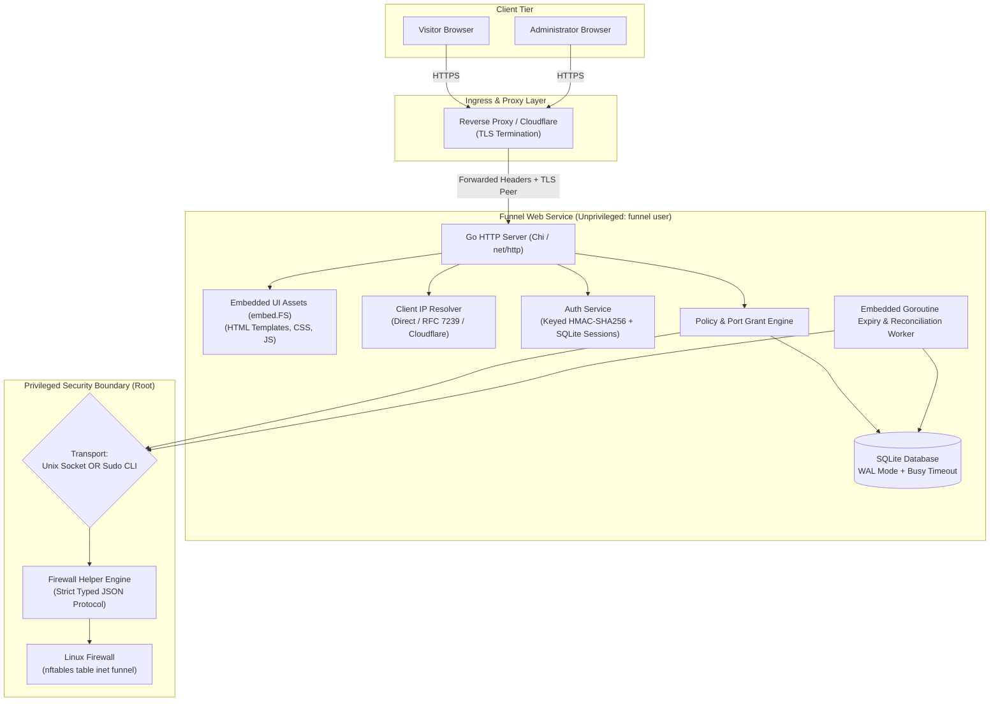
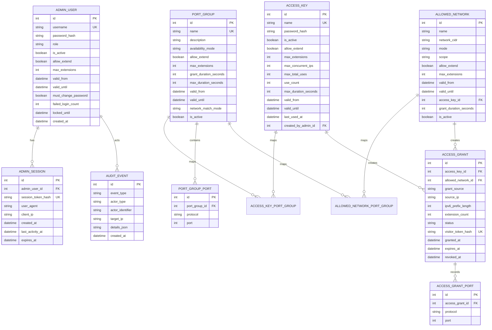

# Funnel: Architecture Decisions & Technical Specification

## 1. Executive Summary

**Funnel** is a secure, lightweight, high-performance Go application compiled to a single standalone static binary. It grants a visitor's detected public IPv4 or IPv6 address temporary access to approved network ports under two authorization modes:
1. **Always-Allowed**: Automated grants when an administrator has marked an IP/CIDR as always allowed.
2. **Password-Only Authenticated**: Visitor enters a valid access password associated with an administrator-managed access key. Visitors are anonymous and do not register or provide usernames.

Administrators manage access keys, port groups, IP/CIDR policies, firewall backends, and audit records through an embedded administrative web portal.

By building in **Go (Golang)**, Funnel achieves **maximum cross-distribution Linux compatibility**: zero Python or runtime dependencies on the host, embedded HTML/CSS/JS templates, instant sub-second startup, tiny Docker images (~25MB), and native Linux syscalls for network namespace and firewall manipulation.

---

## 2. Agreed Architectural Decisions Matrix

| Design Dimension | Decision | Rationale & Trade-offs |
| :--- | :--- | :--- |
| **Language & Toolchain** | **Go (Golang 1.22+)** | Compiles to a single static binary. Eliminates Python runtime/venv dependencies, PEP 668 restrictions, and C-extension compilation across enterprise and modern Linux distributions. |
| **Privileged Helper Transport** | **Pluggable Transport (CLI + Unix Socket)** | The firewall engine is compiled into the binary with dual invocation modes: direct `sudo funnel helper` CLI invocation or a long-running Unix domain socket server (`/run/funnel/helper.sock`). |
| **Primary Firewall Backend** | **`nftables` first (`table inet funnel`) + Mock Backend** | `nftables` is the reference Linux backend leveraging native element timeouts and sets; an in-memory `MockFirewallAdapter` enables complete CI/CD and non-root test coverage. `iptables`, `ufw`, and `firewalld` adapters follow behind the unified Go interface. |
| **Proxy & Client IP Trust** | **Hybrid (.env baseline + Admin UI sync/inspect)** | Trusted proxy CIDRs and proxy mode (`direct`, `reverse_proxy`, `cloudflare`) are loaded from environment variables/config files on startup. Dynamic inspection and Cloudflare official CIDR range refresh are available via the Admin UI. |
| **Anonymous Key Verification** | **Fast Keyed Hash (HMAC-SHA256 with Server Pepper)** | Visitors submit only passwords without usernames. Candidate passwords are evaluated using keyed HMAC-SHA256 with an O(1) indexed database point lookup and `crypto/subtle.ConstantTimeCompare`. Consumes virtually zero CPU (<0.01ms) and 0 MB RAM, completely preventing CPU/RAM exhaustion attacks. Admin accounts maintain standard secure password hashing. |
| **Worker & Reconciliation** | **Embedded Background Goroutine** | Expiration and firewall reconciliation run as a lightweight background Goroutine in the main application process, eliminating extra daemon orchestration for single-host deployments. |
| **Frontend Strategy** | **Self-contained zero-build CSS + JS via `embed.FS`** | Pure CSS, vanilla JavaScript, and Go `html/template` templates compiled directly into the Go executable via `//go:embed`. Zero npm dependencies, zero CDN requests, zero missing asset errors on deployment. |
| **Admin Bootstrap** | **First-run Web Setup Wizard (`/setup`) + One-time Token** | When the database contains zero admin users, `/setup` allows initial administrator creation. Protected by a one-time random 32-character hex bootstrap token logged to stdout. |
| **Visitor Grant Tokens** | **Cookie-only (`/access/current`)** | Opaque grant tokens are stored strictly in `HttpOnly`, `SameSite=Lax`, `Secure` cookies. Visitors view status at `/access/current` and terminate access via `POST /access/revoke`. Tokens never leak into URLs or logs. |
| **Dual-Mode Deployment** | **First-Class Hybrid (Docker & Bare-Metal)** | Funnel works identically with or without Docker. Inside Docker, it runs as a single container bridging host network namespace via `nsenter`. On bare-metal, it runs natively under systemd via an automated, single-binary `install.sh`. |
| **Namespace & Distro Auto-Detection** | **Dynamic auto-detection with manual overrides** | Automatically detects whether `nsenter` is required by comparing `/proc/self/ns/net` with `/proc/1/ns/net` (or detecting `/.dockerenv`). Probes Linux distribution and available firewall backends (`nftables` -> `firewalld` -> `ufw` -> `iptables`). |
| **Hierarchical Path Resolution** | **Environment-aware path fallback** | Configuration and storage automatically map to the active runtime context: Docker (`/data/funnel.db`, `/app/.env`), native systemd (`/var/lib/funnel/funnel.db`, `/etc/funnel/funnel.env`), or local repo dev (`./data/funnel.db`, `./.env`). |
| **Native Ingress & Reverse Proxy** | **127.0.0.1:8000 default + Sample Nginx/Caddy configs** | Native host service binds `127.0.0.1:8000` by default to safely integrate with existing host reverse proxies, shipping with production-ready Nginx and Caddy virtual host snippets. |
| **Shared NAT & Multi-User Privacy** | **Independent login + Zero peer disclosure** | Users sharing the same public NAT/mobile IP authenticate independently. The visitor view strictly shows only the current user's granted ports and remaining time, never disclosing other active users on that IP. |
| **Firewall Rule Refcounting** | **Immediate port delta sync** | Expiring or revoking a grant queries SQLite for all remaining active grants for that IP, removing only the firewall port rules that no longer have any active claim from any user. |
| **Brute-Force & Rate Limiting** | **Two-Tier Defense (Per-IP Backoff + Multi-IP Circuit Breaker)** | Level 1: 5 attempts/min per IP with progressive backoff (30s to 5m max). Level 2: When failures occur across multiple distinct IPs (configurable threshold, default 5 IPs), triggers a temporary circuit breaker pausing password-only access or locking targeted admin users. Admin configurable count and duration with manual UI reset. |
| **Startup Recovery & Reconciliation** | **Full startup reconciliation** | On service start, inspects SQLite, marks grants expired while offline as expired, flushes orphan rules from `table inet funnel`, and re-applies active firewall rules for all currently valid grants. |
| **Dual-Stack IPv6 Support** | **Native IPv4 & IPv6 from v1** | Leverages `nftables` `inet` family for seamless IPv4 and IPv6 support. IPv6 rules default to `/128` host IP, with configurable `IPV6_GRANT_PREFIX=128|64` for rotating SLAAC environments. |
| **Access Key Constraints** | **Optional concurrency & total use caps** | Access keys support optional `max_concurrent_ips` and `max_total_uses` (null = unlimited), enabling disposable one-time keys or restricted team sharing. |
| **Admin Session Security** | **Rolling session with inactivity timeout** | 30-minute idle timeout, 8-hour absolute maximum lifetime, 5-attempt account lockout, and minimum 12-character admin passwords. |
| **Audit Log Retention** | **Configurable retention with daily background prune** | Default 90 days (`AUDIT_LOG_RETENTION_DAYS=90`, 0 = indefinite); async worker automatically prunes expired records daily. |

---

## 3. High-Level Architecture

---

## 4. Security Architecture & Privilege Boundaries

### 4.1 Unprivileged Web Service
The web application runs under an unprivileged system user (`funnel`, UID 10001). It has no capability to execute raw shell commands or mutate network interfaces directly.

### 4.2 Firewall Helper Separation
The firewall helper operates as a separate sub-command (`funnel helper`) or dedicated executable accepting only strict, typed commands:
- `detect_backends`: Query installed/active firewall services.
- `validate_backend(backend_type)`: Run dry-run validation on the active backend.
- `apply_grant(grant_id, ip, ports, duration_seconds)`: Insert a namespaced rule.
- `revoke_grant(grant_id, ip, ports)`: Remove a namespaced rule.
- `list_active_grants()`: Inspect current rules inside `table inet funnel`.

Input validation guarantees that:
- IP addresses must be valid IPv4/IPv6 representations parsed via Go `net/netip`.
- Ports must be integers between 1 and 65535.
- Protocols must be `tcp` or `udp`.
- Namespaces/table names are strictly hardcoded constants (`inet funnel`), never user-controlled parameters.

### 4.3 Setup Wizard Lockdown
When the database contains zero `admin_users`:
1. The server generates a cryptographically secure 32-character hex token via `crypto/rand` and logs it to `stdout`.
2. Any visitor accessing `/setup` must present this bootstrap token.
3. Upon creating the first administrator, the setup route permanently disables itself.

---

## 5. Data Model & SQLite Schema

---

## 6. Route Specifications

### 6.1 Public Visitor Endpoints
- `GET /`: Displays the resolved client IP. If the IP is matched by an active `always_allowed` rule or has an active grant, shows status and port list. Otherwise displays the password access form.
- `POST /access`: Submits password for authentication. On match, registers the grant, sets the HttpOnly visitor cookie, triggers firewall helper, and redirects to `/access/current`.
- `GET /access/current`: Reads visitor cookie, verifies that the request client IP matches the grant's IP, and renders active ports and expiration countdown.
- `POST /access/revoke`: Revokes current active grant, calls firewall helper, clears cookie, and redirects to `/`.
- `POST /access/extend`: Extends active access grant duration. For authenticated named users, extends via single click based on their active session. For password-only visitors, requires re-entering the valid access password.
- `GET /health`: Liveness and readiness status check (returns HTTP 200 with DB status).

### 6.2 Setup & Authentication
- `GET /setup`: Setup wizard form (only accessible when admin count == 0).
- `POST /setup`: Submits bootstrap token + admin username/password.
- `GET /admin/login`: Admin login form.
- `POST /admin/login`: Verifies admin credentials and creates session cookie.
- `POST /admin/logout`: Clears admin session.

### 6.3 Admin Portal Endpoints
- `GET /admin`: Dashboard metrics (active grants, recent events, firewall status).
- `GET /admin/users` & `POST /admin/users`: Admin account management.
- `GET /admin/access-keys` & `POST /admin/access-keys`: Manage anonymous password keys.
- `GET /admin/port-groups` & `POST /admin/port-groups`: Manage port groups and ports.
- `GET /admin/allowed-networks` & `POST /admin/allowed-networks`: Manage IP/CIDR rules.
- `GET /admin/firewalls` & `POST /admin/firewalls/validate`: Firewall detection and selection.
- `GET /admin/grants` & `POST /admin/grants/{id}/revoke`: Grant inspection and revocation.
- `GET /admin/audit`: Administrative audit log viewer.

---

## 7. Implementation Phases & Roadmap (Go)

- **Phase 1: Project Foundation, Core Models & Setup Wizard**:
  - Go module initialization (`go.mod`), pure Go SQLite driver (`modernc.org/sqlite`).
  - Embedded schema migrations via `pressly/goose` or standard SQL scripts.
  - Configuration loader (`caarlos0/env` or standard `os.Getenv` with hierarchical defaults).
  - Setup wizard (`/setup`) with cryptographically secure one-time bootstrap token.
  - Unit tests for DB schema, password hashing, and setup wizard handler.

- **Phase 2: Authentication & Core Visitor Flow**:
  - Fast keyed HMAC-SHA256 access key verification with `crypto/subtle.ConstantTimeCompare` (<0.01ms CPU, 0 MB RAM).
  - Admin login/logout with server-side SQLite session management and secure admin password hashing.
  - Visitor grant cookie issuance and public UI embedded via `//go:embed`.
  - CSRF middleware and tiered IP rate limiting.

- **Phase 3: Port Groups & Network Rules Engine**:
  - Port group management (`port_groups`, `port_group_ports`).
  - IP/CIDR policy management (`allowed_networks`) using Go `net/netip`.
  - Always-allowed vs login-required evaluation logic.

- **Phase 4: Firewall Helper & Adapters**:
  - Pluggable IPC helper interface (CLI sub-command + Unix domain socket).
  - `MockFirewallAdapter` for automated CI/CD unit testing.
  - `NftablesAdapter` targeting `table inet funnel` with dual-stack IPv4/IPv6 support.
  - `iptables`, `ufw`, and `firewalld` adapters.
  - Admin firewall detection and dry-run validation endpoints.

- **Phase 5: Expiration, Reconciliation & Goroutine Worker**:
  - Background Goroutine ticker loop with graceful context cancellation.
  - Immediate port delta sync refcounting on grant revocation/expiration.
  - Full startup reconciliation workflow (offline grant expiration + orphan rule purge).
  - Daily audit event retention pruner.

- **Phase 6: Proxy & Client IP Engine**:
  - Safe client IP resolution: direct socket peer, RFC 7239 `Forwarded`, `X-Forwarded-For`, and `CF-Connecting-IP`.
  - Trusted proxy CIDR verification with Docker/RFC1918 defaults.
  - Cloudflare IP range refresh client and Admin inspection UI.

- **Phase 7: Packaging, Verification & Production Hardening**:
  - Multi-stage Dockerfile compiling a static Go binary into a ~25MB image.
  - Automated `install.sh` native Linux installer (distro package detection, system user, systemd unit).
  - Dual-mode verification (Docker with `nsenter` and bare-metal native execution).

---

## 8. Deployment & Runtime Environments (Native Host vs Docker)

Funnel is engineered to operate seamlessly in both containerized environments and bare-metal / virtual machine Linux installations with identical feature parity.

### 8.1 Runtime Matrix

| Feature | Docker Container Mode | Native Host (Systemd) Mode |
| :--- | :--- | :--- |
| **Binary Footprint** | Static Go binary (~20MB) | Static Go binary at `/usr/local/bin/funnel` |
| **Process Manager** | `tini` as PID 1 inside container | `systemd` unit (`funnel.service`) |
| **Service User** | `funnel` (UID 10001) | `funnel` system user (`/var/lib/funnel`) |
| **Config Location** | `/app/.env` (or environment vars) | `/etc/funnel/funnel.env` |
| **Database Path** | `/data/funnel.db` (persistent volume) | `/var/lib/funnel/funnel.db` |
| **Helper Socket Path** | `/run/funnel/helper.sock` | `/run/funnel/helper.sock` |
| **Network Namespace** | Docker bridge netns -> Host netns via `nsenter` | Host netns natively (direct execution, no `nsenter`) |
| **Network Ingress** | Container port `8000` exposed on external network | Binds `127.0.0.1:8000` (ready for host Nginx/Caddy) |
| **Bootstrap Token Log** | Output to stdout (`docker compose logs funnel`) | Output to stdout / systemd journal (`journalctl -u funnel`) |

### 8.2 Distro & Namespace Auto-Detection Engine

When Funnel starts or executes firewall commands, its detection engine evaluates the environment:

1. **Network Namespace Detection (`FUNNEL_USE_NSENTER=auto`)**:
   - Compares the inode of `/proc/self/ns/net` against `/proc/1/ns/net`.
   - If inodes differ (standard Docker container on bridge network) and `/.dockerenv` is present, `nsenter --net=/proc/1/ns/net` is automatically engaged.
   - If inodes are identical (running natively on host or in `network_mode: host`), `nsenter` is bypassed and commands execute directly.
   - Override supported via `FUNNEL_USE_NSENTER=true|false`.

2. **Linux Distribution & Firewall Backend Auto-Probing**:
   - Inspects `/etc/os-release` to identify distro family (`debian`, `rhel`, `arch`, `alpine`).
   - Probes firewall subsystems in order of preference:
     1. **`nftables`**: Verified via `nft --version` and successful query of existing kernel tables. Default reference backend.
     2. **`firewalld`**: Checked on RHEL/Fedora families via `firewall-cmd --state`.
     3. **`ufw`**: Checked on Ubuntu/Debian families via `ufw status`.
     4. **`iptables`**: Legacy fallback when newer frontends are unavailable.
     5. **`mock`**: In-memory adapter engaged when running in non-root CI or testing environments.
   - Override supported via `FIREWALL_BACKEND=nftables|firewalld|ufw|iptables|mock`.

3. **Hierarchical Configuration & Path Resolution**:
   - **Step 1**: Check explicit environment variables (`DATABASE_PATH`, `CONFIG_PATH`).
   - **Step 2**: If running in Docker (`/.dockerenv` exists) -> `/data/funnel.db`.
   - **Step 3**: If `/etc/funnel/funnel.env` exists -> `/var/lib/funnel/funnel.db`.
   - **Step 4**: Fallback to local development directory -> `./data/funnel.db`.

### 8.3 Automated Native Installation (`install.sh`)

For bare-metal and VM installations without Docker, Funnel ships an idempotent `install.sh`:
- Detects the package manager (`apt`, `dnf`, `pacman`).
- Installs minimal system packages: `nftables` (or distro equivalent) and `sudo`.
- Creates dedicated unprivileged system user `funnel`.
- Installs the compiled `funnel` binary to `/usr/local/bin/funnel`.
- Configures `/etc/sudoers.d/funnel` with strict, non-interactive execution rights for `/usr/local/bin/funnel helper *`.
- Deploys systemd unit `/etc/systemd/system/funnel.service` and default config `/etc/funnel/funnel.env`.
- Starts and enables the service, then retrieves and displays the initial setup URL and bootstrap token from `journalctl -u funnel`.

---

## 9. Operational & Security Specifications

### 9.1 Shared NAT & Multi-User Privacy
- **Anonymous NAT Multiplexing**: Multiple visitors sharing the same public NAT or mobile CGNAT IP can authenticate independently using their own access keys.
- **Strict Isolation & Zero Peer Leakage**: The visitor page at `/access/current` displays only the specific ports and remaining duration granted to the active visitor's cookie session. It never discloses whether other users behind that same IP have active grants or what ports they unlocked.
- **Firewall Union**: The host firewall applies the union of all active ports for that public IP.

### 9.2 Immediate Port Delta Sync & Firewall Refcounting
- When an individual grant expires or is manually revoked via `POST /access/revoke`:
  1. The grant is marked as `expired` or `revoked` in SQLite.
  2. The service queries SQLite for all remaining active grants matching that source IP.
  3. It computes the active port set: `remaining_ports = Union(grant.ports for grant in active_grants if grant.source_ip == IP)`.
  4. The delta ports (`revoked_grant.ports - remaining_ports`) are immediately removed from the firewall backend.
  5. Ports still claimed by other concurrent sessions on that IP remain untouched.

### 9.3 Brute-Force Defense & Two-Tier Rate Limiting

- **Ultra-Low Resource Footprint**:
  - Key verification uses keyed `HMAC-SHA256(ServerPepper, Password)` with indexed SQLite lookup and `crypto/subtle.ConstantTimeCompare`.
  - Consumes <0.01ms CPU time and 0 MB RAM per attempt, making the service completely immune to CPU/memory exhaustion attacks.

- **Level 1: Per-IP Tiered Rate Limiting (Single Source Defense)**:
  - Baseline allowance: Up to 5 failed attempts per rolling 60-second window per client IP.
  - Exceeding allowance: Returns `HTTP 429 Too Many Requests` with a `Retry-After` header.
  - Progressive backoff: Exponential delay increments (30s, 60s, 120s, up to 300s maximum temporary delay).
  - Scope: Confined strictly to the offending IP address.
  - **Protection for Named Users**: If an attacker attempts to guess a user's password from a single IP, only the attacker's IP is delayed. The targeted user account remains unlocked, ensuring legitimate users on other IPs are not subjected to denial-of-service.

- **Level 2: Distributed Multi-IP Circuit Breaker (Botnet / Spray Defense)**:
  - **Concept**: Defends against distributed password-spraying attacks where an attacker rotates across many IP addresses to bypass per-IP thresholds.
  - **Threshold Tracking**: Tracks unique failed client IPs within a rolling sliding window (default: 5 minutes).
  - **Admin-Configurable Thresholds**:
    - `DISTRIBUTED_FAILED_IPS_THRESHOLD`: Number of distinct failed IPs that triggers the circuit breaker (default: `5`, configurable by admin via Admin Settings or `.env`).
    - `DISTRIBUTED_LOCKOUT_DURATION_MINUTES`: Duration of the temporary lockdown (default: `15` minutes, configurable by admin).
  - **Unified Targeted Action Modes**:
    1. **Password-Only Access Lockdown**: When failed password-only attempts on `/access` exceed the multi-IP threshold, public password-only logins are paused globally for the lockout duration. The endpoint returns `HTTP 503 / 429` with a clear cooldown countdown. Active firewall grants remain untouched and continue normally.
    2. **Named User Account Lockout (`admin_users` / Portal Users)**: When failed attempts specifically target a named username across multiple distinct IPs (exceeding the configured threshold), that specific account is locked temporarily (`locked_until`), stopping distributed credential stuffing. Any currently active sessions or open ports for that user remain active and undisturbed.
  - **Audit Logging & Admin Controls**:
    - A high-severity audit event `DISTRIBUTED_BRUTE_FORCE_DETECTED` (or `DISTRIBUTED_USER_LOCKOUT`) is recorded with the list of participating IPs.
    - An alert banner is displayed prominently on the Admin Dashboard.
    - Administrators can click **"Reset Circuit Breaker"** on the dashboard or **"Unlock User"** in the user management table to immediately clear any lock ahead of the timer.

- **User-Facing Blocked State Messaging & UX**:
  When a visitor is blocked or delayed, the server renders a clear, polished notification card rather than an unstyled or cryptic error:
  - **Level 1 (Per-IP Delay)**:
    - Alert Title: *"Too Many Attempts from Your IP"*
    - Message: *"For security, authentication from your address is temporarily paused. Please wait before trying again."*
    - Dynamic Countdown: A live, tick-down timer showing remaining seconds (`Try again in 42s`) with the password submit button disabled until the timer expires.
    - HTTP Header: `Retry-After: <seconds>`.
  - **Level 2 (Circuit Breaker Lockdown)**:
    - Alert Title: *"Authentication Temporarily Paused"*
    - Message: *"Unusual distributed activity has been detected across multiple addresses. New port authorizations are temporarily paused for system security. Please try again later."*
    - Live Cooldown Timer: Displays the estimated time until public access re-opens (`Available in ~12 minutes`).
    - Reassurance for Active Users: *"If you already have an active access session, your existing open ports remain active and unaffected."* with a direct link to `[View Current Status](/access/current)`.
    - HTTP Status: `HTTP 503 Service Unavailable` or `HTTP 429 Too Many Requests` with `Retry-After: <seconds>`.

### 9.4 Full Startup Reconciliation Workflow
When Funnel starts up (after a reboot or service restart):
1. **Audit & Expiration Scan**: Inspects all `access_grants` in SQLite. Any grant whose `expires_at <= now` is transitioned to `status = 'expired'`.
2. **Firewall Reset & Sync**:
   - Queries `table inet funnel` for all existing rules.
   - Computes desired firewall state from all currently valid grants in SQLite.
   - Flushes orphan/stale rules and applies all desired active ports in a clean, atomic transaction.
3. **Log Reconciliation Event**: Writes a structured event to the audit log detailing the number of restored grants and pruned orphan rules.

### 9.5 Dual-Stack IPv6 Support & Scoping
- Native dual-stack support in the IP resolver, policy engine, and firewall adapters.
- Handled natively in `nftables` via `table inet funnel` (supporting both `ip saddr` and `ip6 saddr`).
- Visitor IPv6 grants default to single-host `/128` scope.
- Optional configuration `IPV6_GRANT_PREFIX=128|64` allows granting the `/64` SLAAC prefix for environments where mobile privacy addresses rotate frequently.

### 9.6 Administrator Session Policy & Key Constraints
- **Admin Session Security**:
  - Inactivity timeout: 30 minutes of idle time terminates the session.
  - Absolute session ceiling: 8 hours maximum session lifetime.
  - Account lockout: 5 consecutive failed logins lock the admin account for 15 minutes.
  - Password complexity: Minimum 12 characters required for administrator accounts.
- **Access Key Usage Constraints**:
  - Optional `max_concurrent_ips`: Caps simultaneous active IP grants for a single key (null = unlimited).
  - Optional `max_total_uses`: Self-disables the key after N total successful authentications (null = unlimited).

### 9.7 Audit Event Retention & Pruning
- Configurable retention window via `AUDIT_LOG_RETENTION_DAYS` (default: 90 days; set to 0 for indefinite retention).
- Background Goroutine worker runs an automated daily cleanup query deleting audit events older than the threshold.

### 9.8 Access Duration Extension & Universal Time-Limiting Policy
When an authorized session is active, both user types see an **"Extend Access"** button on `/access/current`:
- **Unified UI Component**:
  - Both named users and password-only visitors see the primary action: `[ Extend Access ]` alongside `[ Disconnect ]`.
  - If extension is disabled for that grant, the button is hidden or disabled with an explanatory tooltip.

- **Granular Administrative Controls (`allow_extend` on any part)**:
  - Administrators can selectively enable or disable extensions on **any governing entity**:
    - **Per User Account** (`admin_users.allow_extend`): Control whether specific named accounts can extend sessions.
    - **Per Access Key** (`access_keys.allow_extend`): Control whether specific password-only keys permit extensions.
    - **Per Port Group** (`port_groups.allow_extend`): Prevent extensions on sensitive port groups (e.g. database ports can be strictly non-extendable while web dev ports are extendable).
    - **Per Allowed Network** (`allowed_networks.allow_extend`): Control extension policy on network CIDR rules.
  - If `allow_extend = false` on **any** governing component of an active grant, extensions are disallowed.

- **Admin-Configurable Maximum Extension Caps (`max_extensions`)**:
  - Administrators can define the maximum number of times an active grant may be extended (e.g. `max_extensions = 1` for a single extension, `2` for twice, `0` for none, or `null` for unlimited up to the duration ceiling).
  - Each extension increments `access_grants.extension_count`. Once `extension_count >= max_extensions`, the button is disabled.

- **Universal Start & End Time Windows (`valid_from` & `valid_until`)**:
  - Administrators can enforce calendar time limits (start date/time and end date/time) across **all entities**:
    - **User Accounts**: User can only authenticate and hold active grants between `valid_from` and `valid_until`.
    - **Access Keys**: Key only accepts logins and extensions between `valid_from` and `valid_until`.
    - **Port Groups**: Port group is only open and active between `valid_from` and `valid_until`.
    - **Allowed Networks**: CIDR policy is only evaluated and active between `valid_from` and `valid_until`.
  - **"Never Expire / Forever" Support**:
    - `valid_until` can be set to **Forever / Never Expire** (`valid_until = NULL`).
    - The Admin UI provides an explicit toggle: `[x] Never Expire (Valid Forever)`.
    - When an entity is set to never expire, it remains permanently active until manually disabled (`is_active = false`). Individual grants still observe their standard grant duration (`grant_duration_seconds`) and extension limits, but are free from any calendar cutoff constraints.
  - **Hard Ceiling Clamping (When `valid_until` is set)**: If a `valid_until` timestamp is defined, no extension or initial grant can ever extend `expires_at` beyond that earliest cutoff date.

- **Strict Maximum Allowed Duration Ceiling (Bounded by Initial Auth Duration)**:
  - The extended duration **shall never exceed the duration given during initial login/authentication**:
    - **No Time-Stacking / Banking**: Extending time resets the countdown timer to at most the original duration from the moment of extension (`expires_at = now() + initial_grant_duration_seconds`), preventing users from stacking or banking time beyond their initial grant.
    - **Cumulative Extension Cap**: Total extra time granted via extension cannot exceed the original duration given at login ($\text{max\_allowed\_lifetime} = \text{granted\_at} + 2 \times \text{initial\_grant\_duration_seconds}$, further bounded by any `valid_until` cutoff).
  - **Ceiling Enforcement**: Once a grant reaches the maximum cumulative allowed duration or extension count, the `[ Extend Access ]` button is automatically disabled on `/access/current` with an informative badge: *"Maximum session limit reached. Further extensions not permitted."*

- **Authenticated Named Users (1-Click Extension)**:
  - Clicking `[ Extend Access ]` immediately submits `POST /access/extend`.
  - The server verifies their active session cookie, CSRF token, `allow_extend` policies, and `valid_until` boundaries.

- **Password-Only Visitors (Password Challenge Modal / Prompt)**:
  - Clicking `[ Extend Access ]` reveals an inline password challenge prompt: *"Enter access password to confirm extension:"* `[ Password Field ] [ Confirm Extend ]`.
  - The server verifies the candidate password against active access keys using keyed `HMAC-SHA256`, checking that the key is still active, within its time window, and permits extensions.

- **Firewall Kernel Refresh**:
  - The firewall helper issues a timeout update to `table inet funnel` without tearing down or resetting state, allowing active TCP/SSH connections to continue without interruption.

