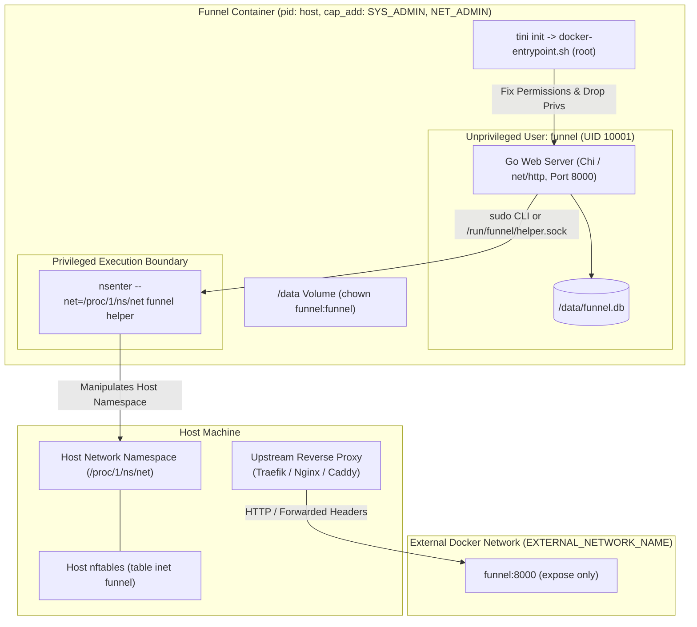

# Funnel: Docker Containerization Technical Specification (Go Implementation)

## 1. Overview & Context

This document captures the finalized containerization design and technical specifications for **Funnel**, established during the `/grill-me` alignment process.

Funnel provides temporary, password-authenticated network port access to a visitor's detected public IPv4 or IPv6 address. Built as a single static Go binary, it encompasses:
1. **Unprivileged Application Layer**: A Go web server (Chi / `net/http`) handling HTTP requests, cookie authentication, SQLite state storage, and a background Goroutine for periodic rule expiration and reconciliation. All HTML templates, CSS, and JS assets are embedded directly into the binary via `//go:embed`.
2. **Privileged Firewall Engine**: A helper executable requiring `NET_ADMIN` privileges to manipulate host Linux firewall tables (`nftables` / `iptables`).

---

## 2. Agreed Architectural Decisions Matrix

| Design Dimension | Decision | Rationale & Trade-offs |
| :--- | :--- | :--- |
| **Container Topology** | **Single Container with Privilege Dropping** | Web application and helper are packaged within one container image. The container starts with `SYS_ADMIN` and `NET_ADMIN` capabilities; the entrypoint drops privileges to run the web server as an unprivileged `funnel` user. |
| **Privilege Execution Model** | **Configurable Dual Mode (`sudo` CLI + Unix Socket)** | Both restricted `sudoers` rules and a lightweight supervisor for Unix domain sockets are packaged. The active mechanism is selectable via `FUNNEL_HELPER_TRANSPORT=sudo|socket` (defaulting to `sudo`). |
| **Host Firewall Bridging** | **`pid: host` with `nsenter`** | The container connects to an external Docker bridge network for reverse proxy access, while the firewall helper invokes `nsenter --net=/proc/1/ns/net` to manipulate the host's native `nftables` tables. |
| **Network & Ingress** | **`expose` only + External Network from `.env`** | The container does not publish host ports directly. It exposes internal port `8000` to a pre-existing external Docker network defined by `EXTERNAL_NETWORK_NAME` in `.env`, assuming an upstream reverse proxy (Traefik, Nginx, Caddy, etc.). |
| **Reverse Proxy & Client IP** | **Auto-trust Docker/RFC1918 + `TRUSTED_PROXIES`** | Standard private and Docker bridge subnets (`172.16.0.0/12`, `10.0.0.0/8`, `192.168.0.0/16`) are automatically trusted when `PROXY_MODE=reverse_proxy`. Explicit CIDR overrides are supported via `TRUSTED_PROXIES`. |
| **Base OS & Build Strategy** | **Multi-Stage Go Build (Debian Slim Runtime)** | Builder stage (`golang:1.26-bookworm`) compiles a static Go binary (`CGO_ENABLED=0`). Runtime stage (`debian:bookworm-slim`) provides official `nftables`, `iptables`, `sudo`, `util-linux` (`nsenter`), and `tini`. Total image size is ~35MB. |
| **Data Persistence** | **Single persistent `/data` volume** | All persistent data (SQLite database `/data/funnel.db` and audit records) resides in `/data`. The entrypoint handles ownership initialization (`chown -R funnel:funnel /data`). |
| **Admin Bootstrapping** | **Strict Console Token Only** | Initial setup requires accessing the one-time random bootstrap token generated on first boot and printed to container stdout (`docker compose logs funnel`). Plaintext passwords in `.env` are prohibited. |
| **Process & Healthcheck** | **`tini` init + Native Go `/health` check** | Uses `tini` as PID 1 to handle signal forwarding and orphan reaping. A lightweight health check probes `http://127.0.0.1:8000/health`. |

---

## 3. Container Architecture & Privilege Separation



### 3.1 Unprivileged User Specifications
- User: `funnel`
- Group: `funnel`
- UID: `10001`
- GID: `10001`
- Home: `/home/funnel`
- Shell: `/bin/bash`

### 3.2 Sudoers Policy (`/etc/sudoers.d/funnel`)
When `FUNNEL_HELPER_TRANSPORT=sudo`, the unprivileged user has strictly locked-down execution rights:
```text
funnel ALL=(root) NOPASSWD: /usr/local/bin/funnel helper *, /usr/bin/nsenter --net=/proc/1/ns/net /usr/local/bin/funnel helper *
```
No other commands or shell escapes are permitted.

---

## 4. Host Network Namespace Bridging & Auto-Detection

Because the container joins an external Docker bridge network to communicate with the reverse proxy, standard container commands operate inside the container's isolated network namespace (`/proc/self/ns/net`).

To grant temporary access on host ports (e.g. host SSH on port 22 or host services on port 5432):
1. The container is started with `pid: host` and capabilities:
   - `CAP_SYS_ADMIN` (required to call `setns` / `nsenter` into another process's namespace).
   - `CAP_NET_ADMIN` (required to mutate `nftables` chains and sets).
2. The firewall helper includes auto-detection logic (`FUNNEL_USE_NSENTER=auto`):
   - It checks whether `/proc/self/ns/net` differs from `/proc/1/ns/net`.
   - In Docker (bridge network), they differ: the helper automatically wraps firewall commands with `nsenter --net=/proc/1/ns/net /usr/local/bin/funnel helper "$@"`.
   - On native host or `network_mode: host`, they are identical: `nsenter` is completely bypassed.
3. This applies all `table inet funnel` rules directly into the host's network namespace, while the Go server remains accessible to the reverse proxy via the Docker bridge network.
4. The exact same binary and helper logic runs unchanged in both Docker and native systemd environments.

---

## 5. Docker Deployment Topology

### 5.1 Compose Blueprint (`docker-compose.yml`)
```yaml
services:
  funnel:
    build:
      context: .
      dockerfile: Dockerfile
    container_name: funnel
    restart: unless-stopped
    pid: host
    cap_add:
      - SYS_ADMIN
      - NET_ADMIN
    expose:
      - "${FUNNEL_PORT:-8000}"
    networks:
      - proxy_network
    volumes:
      - funnel_data:/data
    env_file:
      - .env
    healthcheck:
      test: ["CMD", "/usr/local/bin/funnel", "health"]
      interval: 30s
      timeout: 5s
      retries: 3
      start_period: 5s

networks:
  proxy_network:
    external: true
    name: ${EXTERNAL_NETWORK_NAME:-web_proxy}

volumes:
  funnel_data:
    name: ${FUNNEL_VOLUME_NAME:-funnel_data}
```

### 5.2 Environment Configuration (`.env.example`)
```env
# Application Port inside container
FUNNEL_PORT=8000

# External Docker Network Name (where your reverse proxy runs)
EXTERNAL_NETWORK_NAME=web_proxy

# Volume name for SQLite database and logs
FUNNEL_VOLUME_NAME=funnel_data

# Ingress Proxy Settings
PROXY_MODE=reverse_proxy
TRUSTED_PROXIES=172.16.0.0/12,10.0.0.0/8,192.168.0.0/16

# Security & Secrets
SECRET_KEY=change-this-to-a-secure-random-secret-key-in-production

# Helper Transport & NetNS
FUNNEL_HELPER_TRANSPORT=sudo
FUNNEL_USE_NSENTER=auto

# Database Path
DATABASE_PATH=/data/funnel.db

# Logging
LOG_LEVEL=INFO
```

---

## 6. Dockerfile Multi-Stage Build Blueprint

```dockerfile
# Stage 1: Build static Go binary
FROM golang:1.26-bookworm AS builder

WORKDIR /build

# Cache dependencies
COPY go.mod go.sum ./
RUN go mod download

# Copy source code and embedded assets
COPY . .

# Compile static binary without CGO
RUN CGO_ENABLED=0 GOOS=linux go build \
    -ldflags="-s -w" \
    -o /build/funnel ./cmd/funnel

# Stage 2: Minimal runtime image
FROM debian:bookworm-slim AS runtime

WORKDIR /app

RUN apt-get update && apt-get install -y --no-install-recommends \
    nftables \
    iptables \
    sudo \
    util-linux \
    tini \
    ca-certificates \
    && rm -rf /var/lib/apt/lists/*

# Create unprivileged user & group
RUN groupadd -g 10001 funnel && \
    useradd -u 10001 -g funnel -d /home/funnel -m -s /bin/bash funnel

# Install static Go binary from builder
COPY --from=builder /build/funnel /usr/local/bin/funnel

# Setup directories, entrypoint, and permissions
COPY docker-entrypoint.sh /app/docker-entrypoint.sh
RUN mkdir -p /data /run/funnel && \
    chown -R funnel:funnel /data /run/funnel && \
    chmod +x /app/docker-entrypoint.sh /usr/local/bin/funnel

EXPOSE 8000

ENTRYPOINT ["/usr/bin/tini", "--", "/app/docker-entrypoint.sh"]
CMD ["/usr/local/bin/funnel", "serve"]
```

---

## 7. Entrypoint Lifecycle (`docker-entrypoint.sh`)

1. **Volume Permissions Verification**:
   - Inspect `/data` ownership and run `chown -R funnel:funnel /data /run/funnel`.
2. **Transport Initialization**:
   - If `FUNNEL_HELPER_TRANSPORT=socket`: Launch the socket daemon in the background as root (`funnel helper daemon --socket /run/funnel/helper.sock`), grant `funnel:funnel` socket permissions.
   - If `FUNNEL_HELPER_TRANSPORT=sudo`: Ensure `/etc/sudoers.d/funnel` is installed with `0440` permissions.
3. **Privilege Drop & Execution**:
   - Execute the application under user `funnel` using `su -s /bin/bash funnel -c "$*"`.
4. **First-run Log Output**:
   - Web setup wizard generates a random bootstrap token and prints prominently to stdout:
     ```text
     ================================================================================
     [FUNNEL BOOTSTRAP] Setup token: a9f4c32e18d6...
     Navigate to http://<your-domain>/setup and use this token to create an admin.
     ================================================================================
     ```

---

## 8. Summary of Alignment Checklist

- [x] Single container packaging with internal privilege dropping
- [x] Go static binary (`CGO_ENABLED=0`), zero host Python/pip dependencies
- [x] Embedded UI templates and static assets via `//go:embed`
- [x] Pluggable privilege transport (`sudo` CLI + Unix socket daemon)
- [x] Host network namespace bridging via `pid: host` + `nsenter --net=/proc/1/ns/net`
- [x] External Docker network attachment for upstream reverse proxy
- [x] No exposed host ports (reverse proxy routing only)
- [x] Automatic private/Docker subnet trust with configurable `TRUSTED_PROXIES`
- [x] Tiny footprint (~35MB container, ~20MB static binary)
- [x] Single persistent volume at `/data` for SQLite and logs
- [x] Strict console bootstrap token for initial admin setup (no plaintext passwords in `.env`)
- [x] Native binary health check (`funnel health`) and `tini` process management
